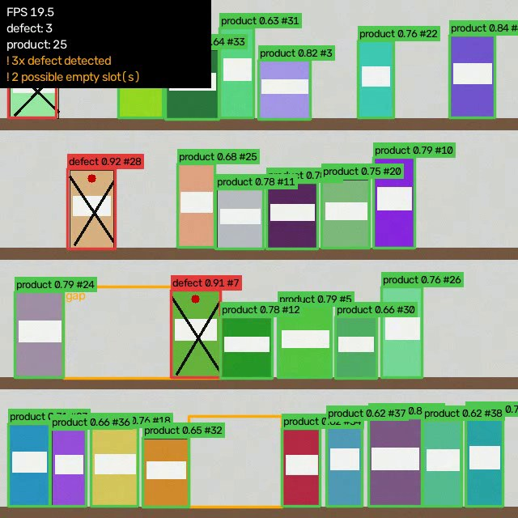

# ShelfSense

Computer vision that detects products and defects on shelves in real time, using a fine-tuned YOLO model.

ShelfSense wraps [Ultralytics YOLO](https://docs.ultralytics.com/) with everything around the model that a shelf-monitoring use case needs:

- **Fine-tuning** a pretrained YOLO checkpoint on your own shelf photos (`shelfsense train`)
- **Real-time inference** on a webcam, video file or RTSP stream, with ByteTrack object tracking (`shelfsense detect`)
- **Shelf analytics** on top of the raw boxes:
  - per-class product counts, smoothed with a rolling median so they don't flicker
  - **empty-slot detection**: shelf rows are reconstructed from the boxes and horizontal holes wider than a product are flagged
  - **low-stock alerts** per class
  - **defect alerts** for classes you mark as defects (crushed packaging, leaks, wrong item...)
  - optional JSONL alert log with per-alert cooldown
- **Edge export** to ONNX / OpenVINO / TensorRT / TFLite (`shelfsense export`)
- A **synthetic shelf generator** so the whole pipeline runs end to end without downloading a dataset



*Frame from the synthetic demo video: green = products (with track ids), red = defects, amber = possible empty slots.*

**Measured on the synthetic dataset** (`yolo11n`, 15 epochs, CPU only, 160 images): mAP50 0.995, mAP50-95 0.93 on the held-out split, and ~20 FPS end-to-end (detection + tracking + analytics + drawing) on an i7-13650HX CPU. The synthetic task is easy, so this validates the pipeline, not real-world accuracy.

## Install

```bash
git clone https://github.com/Mohammmed-Waleed/ShelfSense.git
cd ShelfSense
python -m venv .venv && source .venv/bin/activate   # Windows: .venv\Scripts\activate
pip install -e ".[dev]"
```

For NVIDIA GPU training/inference install a CUDA build of PyTorch first (see <https://pytorch.org/get-started/locally/>), then the command above.

## Quick start (no dataset needed)

```bash
# 1. generate a synthetic dataset + a demo video
shelfsense synth --out datasets/synthetic --n 240 --video datasets/demo.mp4

# 2. fine-tune (starts from yolo11n.pt, downloaded automatically)
shelfsense train --data datasets/synthetic/data.yaml --epochs 30 --device 0

# 3. evaluate
shelfsense eval --weights models/shelfsense.pt --data datasets/synthetic/data.yaml

# 4. real-time detection + analytics on the demo video (drop --no-show to get a live window)
shelfsense detect --weights models/shelfsense.pt --source datasets/demo.mp4 \
    --config configs/shelfsense.yaml --save runs/demo_out.mp4 --alert-log runs/alerts.jsonl --no-show

# live webcam
shelfsense detect --weights models/shelfsense.pt --source 0 --config configs/shelfsense.yaml
```

The synthetic data (coloured boxes on shelves, "defect" = cracked box) is a smoke test and demo, **not** a substitute for real data. Metrics on it say nothing about real-world accuracy.

### Skip training: download the demo weights

The model from step 2 is published as [release v0.1.0](https://github.com/Mohammmed-Waleed/ShelfSense/releases/tag/v0.1.0) (YOLO11n, 5.5 MB, trained on the synthetic data only):

```bash
curl -L --create-dirs -o models/shelfsense.pt https://github.com/Mohammmed-Waleed/ShelfSense/releases/download/v0.1.0/shelfsense.pt
```

SHA-256: `e07fce9af4d121ba8fb93cec5f76b655099ae8a2db3d561ac94b4e844b7b373d`. Then generate the demo video (step 1) and run step 4.

## Training on real shelf data

Put images and YOLO-format labels in this layout and write a `data.yaml`:

```
my_dataset/
  images/{train,val}/*.jpg
  labels/{train,val}/*.txt      # one "class cx cy w h" line per object, normalised 0-1
  data.yaml                     # path, train, val, names: {0: product, 1: defect, ...}
```

Good public starting points:

- **SKU-110K**, dense retail shelf product detection. Ultralytics ships a ready config: `shelfsense train --data SKU-110K.yaml` (about 13 GB download, auto-fetched).
- Roboflow Universe has many shelf, product and packaging-defect datasets exportable in YOLO format.
- Your own photos, labelled with [CVAT](https://www.cvat.ai/), [Label Studio](https://labelstud.io/) or Roboflow.

Tips for shelves: label *every* visible item (missed labels teach the model that products are background), shoot at the angle the camera will really have, and include empty-shelf and damaged-item examples so the gap and defect logic has something to work with.

## Analytics config

`configs/shelfsense.yaml`:

| key | meaning |
| --- | --- |
| `product_classes` | labels counted as stock (empty = every non-defect label) |
| `defect_classes` | labels that always raise an alert |
| `low_stock` | `{label: minimum}`: alert when the smoothed count drops below |
| `gap_factor` | a hole wider than `gap_factor` x median product width is an empty slot |
| `row_tol` | how close (in product heights) box centres must be to share a shelf row |
| `min_row_items` | rows with fewer products are too sparse to judge |
| `gap_persist_frames` | a gap is reported only after it persists this many frames, so detector flicker isn't flagged |
| `smooth_frames` | rolling-median window for counts |

The analytics are plain Python (`shelfsense.ShelfAnalyzer`), so you can feed them detections from any model:

```python
from shelfsense import ShelfAnalyzer, AnalyticsConfig, Detection

analyzer = ShelfAnalyzer(AnalyticsConfig(low_stock={"product": 20}))
report = analyzer.analyze(detections)   # list[Detection]
report.counts, report.gaps, report.alerts
```

## Project layout

```
shelfsense/
  detector.py    YOLO wrapper -> Detection objects (+ ByteTrack ids)
  analytics.py   counts, empty-slot detection, alerts (no torch needed)
  realtime.py    capture loop, overlay, video writer, alert log
  train.py       fine-tune / evaluate / export
  synthetic.py   synthetic dataset + demo video generator
  cli.py         `shelfsense` command
configs/         analytics settings
tests/           pytest suite (analytics + dataset generator)
```

## Tests

```bash
pytest
```

## Limitations

- Empty-slot detection is geometric: it infers a missing item from a hole in a row of detections. It assumes roughly horizontal rows and similarly sized products, and will be less reliable on strongly angled shots or mixed-size packaging.
- Counts reflect what the model sees; heavily occluded or stacked items will be undercounted.
- Weights are not committed to the repo. The [v0.1.0 release](https://github.com/Mohammmed-Waleed/ShelfSense/releases/tag/v0.1.0) has demo weights trained on synthetic data; for real shelves, fine-tune on real photos.

## License

MIT
